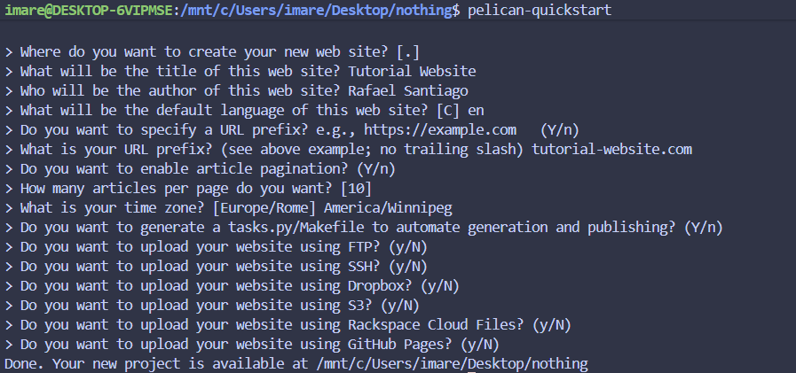
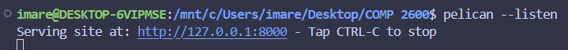

# Hosting a Website
This is a complete beginner's tutorial on how to compile and upload a website online. This repository hosts an example of a webpage using Pelican, a static site generator that compiles Markdown into HTML.

*Continue onto the [Build and Preview Instructions](#build-and-preview-instructions) if you would like to compile the website.*

# Building Your Own Website
*This tutorial assumes that you are using Linux, and that you know how to navigate the filesystem and run commands in the terminal.*

Welcome to the world of static website generators! This is a fully-fledged tutorial on how to compile and upload your own website to the Internet for others to view. For this tutorial, we will use [Pelican](https://getpelican.com/), a *static site generator*. A static site generator lets you build your own website easily, which Pelican allows us to do by using [Markdown](https://en.wikipedia.org/wiki/Markdown) to allow us to write content for our website without involving ourselves in raw HTML. In the end, we will host our website on Gitlab Pages.

1. Open your terminal. Install pelican by running the command ``sudo apt-get install pelican``.

2. Navigate to the directory where you would like your website to be stored.

3. Start a new Pelican project by running the command ``pelican-quickstart``, then answer the questions asked by the terminal. The image below should match your terminal, bar any opinionated questions like the name of your website.



4. Make a new file named ``index.md``, or by any other appropriate name. We will be creating articles for our website.

5. Paste the following text into the top of ``index.md`` (or the file you just created):

```
Title: Resume
Date: March 5, 2026
```

This provides the *metadata*, data meant for use by the SSG. The title should be the name of your article, and the date should be the publishing date of the article.

6. Write the contents of your article using Markdown. If you do not know how to use Markdown, [The Markdown Guide is available and is a nifty guide to use.](https://www.markdownguide.org/basic-syntax/). Once you are done with writing, we will move on to generating the website with Pelican.

7. Generate your website by running ``pelican content`` in your terminal. This will generate the website from the ``.md`` files located in your ``content`` folder. The ``.html`` and ``.css`` files that compose your website will be located in a new folder called ``output``.

8. Start a web server by running ``pelican --listen``, which will allow you to host your website locally on your computer.

9. Preview your website by pasting ``localhost:8000`` in your web browser, or hold control and click on the local site link in your terminal (seen in the image below).



# Prerequisites
Access to a Linux terminal. The resources here are possible to install on other platforms (Windows and Mac), but the instructions here do not describe installation on any platform other than a Linux distribution that uses ``apt``.

# Build and Preview Instructions

1. Install Pelican, through the [Pelican quickstart guide](https://docs.getpelican.com/en/3.6.2/quickstart.html).

2. Navigate to a folder through your terminal, which is wherever you want the repository to be located.

3. Clone the project by running ``git clone https://code.cs.umanitoba.ca/santiara/comp-2600-static-website.git .`` in your terminal.

4. Download the theme (waterspill-en)[https://github.com/getpelican/pelican-themes] by cloning the repository into the directory by running ``git clone https://github.com/getpelican/pelican-themes.git pelican-themes``.

5. Install the theme by running ``pelican-themes --install pelican-themes/waterspill-en``.

6. Run ``pelican-themes --list --verbose``. Note the directory of waterspill-en.

7. 

4. Compile the website into HTML by running ``pelican content``, which will be stored in ``/output``.

5. Start a local web server by running ``pelican --listen`` to preview the website.

6. Navigate to ``localhost:8000`` in your web browser, or hold control and click on the local site link in your terminal.

# External Resources
- [The Markdown Guide](https://www.markdownguide.org/) is an excellent resource as a reference guide for Markdown.

- [The Pelican quickstart page](https://docs.getpelican.com/en/3.6.2/quickstart.html) provides a fast guide to get your static site easily up and running.

- [Pelican Themes](https://pelicanthemes.com/) is a great repository of themes that you can install for your website. Each theme has a separate license, so make sure to check and comply with it if you intend to use a theme.

- [Awesome Static Site Generators](https://github.com/myles/awesome-static-generators) has a massive list of SSGs if you are interested in using an SSG other than Pelican.

# Frequently asked questions (FAQ)
## Why is Markdown better than writing raw HTML?
Raw HTML is harder to read compared to Markdown. See this small snippet of the resume in HTML:
```html
<h2>University of Manitoba (2023 - Present)</h2>
<ul>
  <li>GPA: Alot</li>
  <li>Studying computer science.</li>
</ul>
```
and compare it to its equivalent in Markdown:
```md
## University of Manitoba (2023 - Present)
- GPA: Alot
- Studying computer science.
```

The Markdown snippet is much easier to parse by a human. It even remains elegant to read in its raw text form, unlike HTML which is littered with tags. Writing in Raw HTML is possible to do, but you will find Markdown to be easier to write in as you write more complex web pages and content.

## I changed the Markdown version of my resume, so why don’t I see the changes when I refresh the website in my browser?
Update the website by running ``pelican .`` in your website directory before refreshing the website. If you are hosting a local web server with ``pelican --listen``, end the server by pressing ``ctrl+c`` in the terminal before updating the website.

# Credits
## Contributors
I would like to thank the following:
- Ashley and Marco, who are my group members for COMP 2600.
- Andrew Etter, whose book *Modern Technical Writing* helped to improve the prose of this README.
- Tristan Miller, the professor of COMP 2600, who taught me how to use Pelican.
- Peter Vu, the teaching assistant of COMP 2600, who helped me in class during the workshop.

## Resources used
The website uses the [waterspill-en](https://github.com/getpelican/pelican-themes/tree/master/waterspill-en) theme, which uses the MIT license.